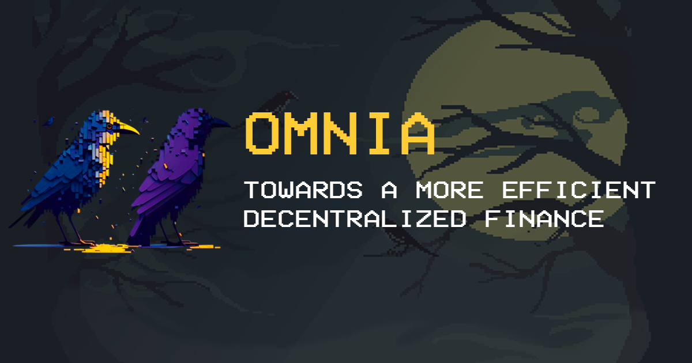
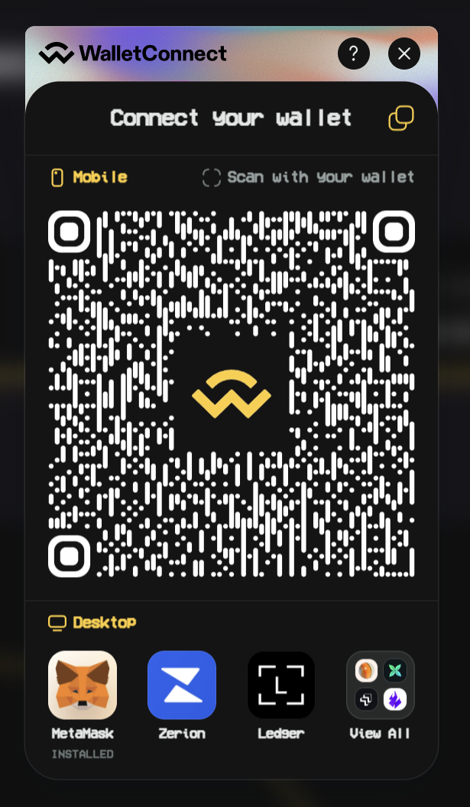
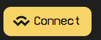
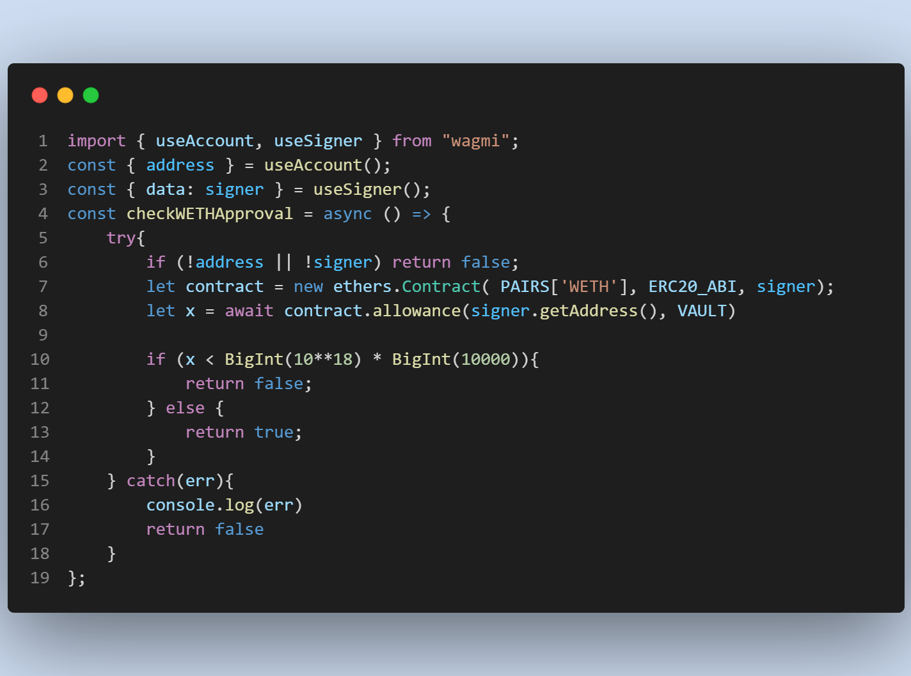

# OMNIA
in omnia paratus Latin phrase

: prepared in all things : ready for anything

## ETH Denver 2023 Buildathon

### 🚝Track: 
#### Decentralized Finance

### 💰 Bounties:
##### - Web3Modal Theming Challenge
OMNIA utilizes and customize the Web3Modal theming to match the OMNIA brand. That includes both **color** and **font**. Here is a screenshot of the Web3Modal theme in action:

###### Web3modal


###### Web3modal button


##### - Web3Modal Creative Challenge
All smart contract transactions in OMNIA are initialized via the Web3Modal SDK. This allows users to connect to their wallet of choice and sign transactions. In OMNIA, all wallet states are handled by Web3Modal.

All contracts transactions are located in the src/hooks/useContractHelpers.ts file. Which utlizie the wagmi SDK to get the signer and initialize the contract.

For example this is one of the function that checks for WETH approval 



##### - Web3Modal DeFi Challenge: Making Bank (Without the Banks)
OMNIA UI provides a simple and easy user interface for users to interact with the OMNIA smart contracts. Web3Modal plays a crucial role in all of the transactions that occur in the OMNIA.


## Getting Started

To test OMNIA in your local enviornment, you will need to run the following commands:

```bash
npm run install
npm run dev
```

Open [http://localhost:3000](http://localhost:3000) with your browser to see the result.

## Demo

You can view a demo of OMNIA at [https://omnia-ethdenver.vercel.app/](https://omnia-ethdenver.vercel.app/)

## Related Repositories
[OMNIA Smart Contracts]()
[OMNIA Backtest]()

##License

This project is licensed under the MIT License. 

For more information, please see the [LICENSE](LICENSE) file.
